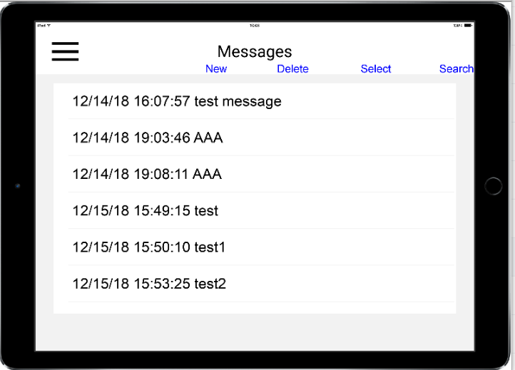
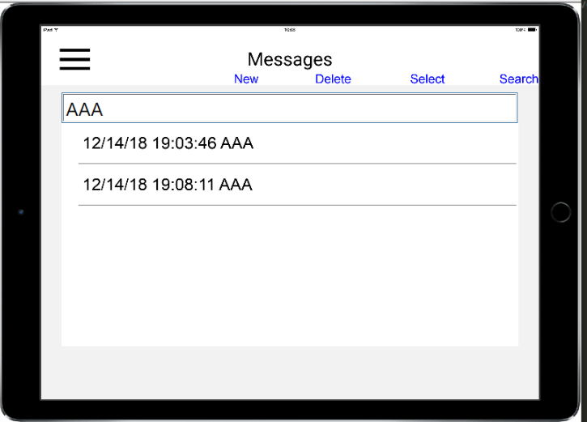
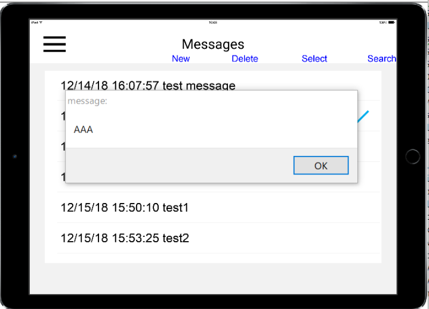
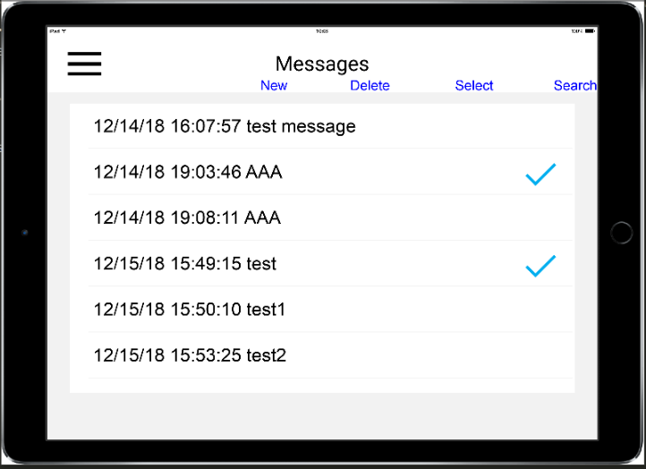

# simple table sample

the classes for the table widget and the sqlite codes are refactored out of CoronaLabs weather sample


* https://github.com/coronalabs-samples/CoronaWeather



* Search 

    

* Tap to pop up a message

    


* tapped messages are displayed with check marks. Tap again to clear the check mark

    

## Lua files
* *main.lua*
* *messagesTable.lua*
* classes/
    * *mycontrol.lua*
        * onSearchRowTouch()
        * deleteRow()
        * dismisKeyboard()
        * onSearchEvent()
        * onSelectEvent()
        * onDeleteEvent()
        * onInsertEvent()
        * onMessageRowTouch()
        * messageListener()
        * reloadData()
        * fieldHandler()

    * *mydata.lua*
        * init()
        * close()
    * *messageDB.lua*
        * open()
        * close()
        * insert()
        * update()
        * delete()
        * nrows()
        * search()
    * theme.lua
        * setTheme()
        * textColor
        * rowBackgroundColor
        * backgroundColor
        * navBarBackgroundColor
        * navBarTextColor
        * fontBold
    * ui.lua
        * leftButtonEvent()
        * createNavBar()
* libs/
    * widget-extras.lua
        * newNavigationBar()
* images/

    * hamburger-dark.png
    * hamburger-dark@2x.png
    * hamburger-dark@4x.png
    * hamburger-light.png
    * hamburger-light@2x.png
    * hamburger-light@4x.png

        

----
## main.lua
* Theme module is set with "light"
* The NavBar code. It sits above all composer scenes
* Composer module to goto "messageTable" scene

```lua
local theme = require( "classes.theme" )
local UI    = require( "classes.ui" )

theme.setTheme( "light" )
UI.createNavBar()

local composer = require( "composer" )
composer.gotoScene("messagesTable")
```

---
## messageTable.lua
### creating the messages table and the menu buttons
* background listens "touch" event to dismiss keyboard of Search text box(messageEntryField)
* New, Delete, Select, Search buttons on the navigation bar
    * onInsertEvent
    * onDeleteEvent
    * onSelectEvent
    * onSearchEvent
        * shows Search text box(messageEntryField)
        * the fieldHandler of the text box calls lookupMessage() with a text string the user inputs
        * lookupMessages searches messages in messageDB and calls scene.displayHits()
* messageTableView with **onMessageRowTouch** which is implemented in mycontrol.lua to judge swipe or just tap
    * swipe to show "Delete" button for the row
        * *onMessageRowRender* create the Delete button
    * tap(not swiping) to select the row. A check mark is displayed

```lua
function scene:create( event )
...
...
    sceneBackground:addEventListener( "touch", myCtrl.dismisKeyboard )
...
...
    rightButton = widget.newButton({
                id = "searchBtn",
                label = "Search",
                onEvent = myCtrl.onSearchEvent,
                font = myData.font,
                fontSize = 12,
                labelColor = { default={ 0, 0, 1 }, over={ 1, 0, 0, 0.5 } },
                labelAlign = "right",
            })
        --
        rightButton.x = display.contentWidth - rightButton.width*0.5
        rightButton.y = UI.navBar.height - 6
        UI.navBar:insert(rightButton)
...
        UI.navBar:insert(rightButton2)
...
        UI.navBar:insert(rightButton3)
...
        UI.navBar:insert(rightButton4)

...
...
    messagesTableView = widget.newTableView({
        left        = 20,
        top         = 60 + statusBarPad,
        height      = messageTableViewHeight,
        width       = display.contentWidth - 40,
        onRowRender = onMessageRowRender,
        onRowTouch  = myCtrl.onMessageRowTouch,
        hideBackground = true,
        listener = myCtrl.messageListener
    })
    self.messagesTableView = messagesTableView
    sceneGroup:insert( messagesTableView )
end
```

* onMessageRowRender. 
    * if tapped, shows a check mark
    * if the row is swiped, it shows Delete button. 

```lua
local function onMessageRowRender( event )
    ...
    ...
    if params.selected then
        local checkMark = display.newImageRect( row, "images/checkmark.png", 30, 30 )
        checkMark.x = rowWidth - 30
        checkMark.y = rowTitle.y
    end
    if not params.noDelete then
        local deleteButton = display.newGroup()
        ...
        ...
        deleteButton:addEventListener( "touch", myCtrl.deleteRow )
        ...
        ...
        row:insert( deleteButton )
    end
end
```

### Search

* Search text box(messageEntryField) is created in scene:show(). It appears when user clicks Search button
    * mycontrol fieldHandler calls lookupMessages() inside to search text in sqlite
    * then displayHits is called with the results

```lua
function scene:show( event )
    local sceneGroup = self.view
    if event.phase == "will" then
        myData.init()
        myCtrl.reloadData()
        UI.navBar:setLabel( "Messages" )
        ...
        ...
    else
        ...
        ...
        messageEntryField = native.newTextField( 20, ...)
        messageEntryField:addEventListener( "userInput", 
            myCtrl.fieldHandler( function() return messageEntryField end ) )
        ...
        ...
    end
end
```

* displayHits makes **searchTableView** visible and hides messageTableView 

```lua
function scene.displayHits( )
    ...
    ...
    messagesTableView.isVisible = false
    searchTableView = widget.newTableView({
        left = 20,
        top = messageEntryField.y + 15,
        height = display.actualContentHeight - messageEntryField.y - 65,
        width = display.actualContentWidth - 40,
        onRowRender = onSearchRowRender,
        onRowTouch = myCtrl.onSearchRowTouch,
    })
    --
    scene.searchTableView = searchTableView
    --
    ...
    ...
    for i = 1, #myData.messageChoices do
        searchTableView:insertRow({
            isCategory = isCategory,
            rowHeight = rowHeight,
            rowColor = rowColor,
            lineColor = lineColor,
            params = {
                time = myData.messageChoices[i].time,
                message = myData.messageChoices[i].message,
                id = i
            },
        })
    end
end
```

---
## mycontrol.lua

* fieldHandler of messageEntryField calls lookupMessage()

```lua
function M.lookupMessage( text )
    ...
    ...
    messagesDB.search(text, function(row)
        myData.messageChoices[ #myData.messageChoices + 1 ] = { time = row.time, message = row.message }
    end)
    if #myData.messageChoices <= 100 then
        scene.displayHits()
    end
end

```

* onSearchRowTouch calls native.showAlert with message on Search Table View
```lua
function M.onSearchRowTouch( event )
    if event.row then
        if "tap" == event.phase or "release" == event.phase then
            local idx = event.row.id
            for i = 1, #myData.messages do
                myData.messages[i].selected = false
            end
            native.showAlert("message:", myData.messageChoices[idx].message, { "OK" } )
        end
    end
    native.setKeyboardFocus( nil )
    return true
end

```

* **onMessageRowTouch** judges swiped or selected on Messages Table View

```lua
function M.onMessageRowTouch( event )
    ...
    if "press" == event.phase then
        wasSwiped = false
    elseif "swipeLeft" == event.phase and ... then
        wasSwiped = true
        if row and event.row.deleteButton then
            event.row.deleteIsShowing = true
        end
    elseif "swipeRight" == event.phase and ... then
        wasSwiped = true
        if row and event.row.deleteButton then
            event.row.deleteIsShowing = false
        end
    elseif "release" == event.phase then
        if row then
            if not wasSwiped then
                ...
                ...
                if myData.messages[row.id].selected ~=true then
                    myData.messages[row.id].selected = true
                else
                    myData.messages[row.id].selected = false
                end
                M.reloadData()
                native.showAlert("message:", myData.messages[row.id].message, { "OK" } )
            end
        end
        wasSwiped = false
    end
    ...
    ...
end

```
---
## messageDB.lua

* sqlite file name is *messages.db*
* the table name is *messages*
* it contains *time* and *message* fileds

```lua
...
...
local path = system.pathForFile("messages.db", system.DocumentsDirectory)
M.open = function()
    db = sqlite3.open( path )
    local tablesetup = [[CREATE TABLE IF NOT EXISTS messages (id INTEGER PRIMARY KEY, time, message);]]
    db:exec( tablesetup )
    return db
end

M.close = function()
    db:close()
end

M.insert = function(time, msg)
    local tablefill =[[INSERT INTO messages VALUES (NULL, ']]..time..[[',']]..msg..[['); ]]
    db:exec( tablefill )
end

M.delete = function(id)
    local tablefill =[[DELETE FROM messages WHERE id= ]]..id..[[; ]]
    db:exec( tablefill )
end

M.update = function(id, time, msg)
    local tablefill =[[UPDATE messages SET time='']]..time..[[' message=']]..msg..[[', WHERE id= ]]..id..[[; ]]
    db:exec( tablefill )
end

M.nrows = function(callback)
   if callback then
    for row in db:nrows("SELECT * FROM messages") do
        local text = row.time.." "..row.message
        print(row.id, text)
        callback(row)
    end
   else
       return db:nrows("SELECT * FROM messages")
   end
end

M.search = function(value, callback)
    for row in db:nrows("SELECT * FROM messages WHERE LOWER(message) LIKE '" .. value .. "%' ORDER BY time") do
        callback(row)
    end
end
...
...
return M
```